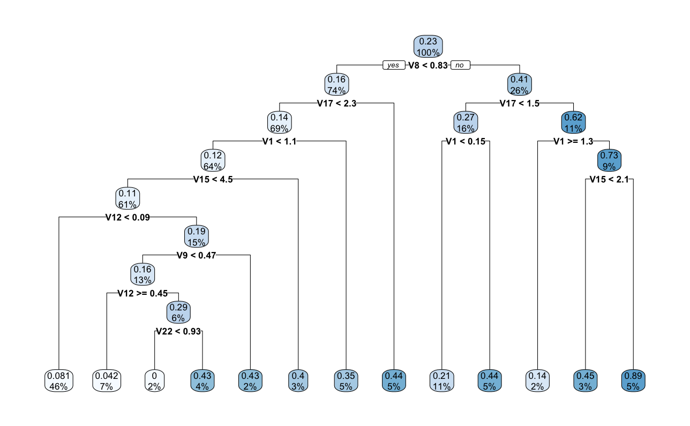

```{r setup, include=FALSE}
knitr::opts_chunk$set(echo = TRUE)
```

# Introduction
This project aims to explore different algorithms for causal inference. Causal inference refers to the process of drawing a conclusion about a causal connection based on the conditions of the occurrence of an effect. The goal is to estimate the average treatment effect (ATE) in detail through implementation (using R), evaluation, and comparison. The algorithms include Inverse Propensity Weighting, Doubly Robust Estimation, and Regression Estimate. For the first two algorithms, we also had to compute propensity score using classification and regression trees (CART). To evaluate our algorithms, we were given two datasets (low-dimensional and high-dimensional) as well as correct ATE.

# Step 1: Computing Propensity Scores
### Classification and Regression Trees (CART)
CART is a classification and regression algorithm, which specify a ‘tree’ of cut points that minimize some measures of diversity in the final nodes once the the tree is complete. On the image below, you can see an example of a decision tree for a low-dimensional data set. 

{width=70%}

One of the CART's benefits is that it can  provide a probability of class membership, which we will use as our propensity score.

For CART method, we first split the space into two regions, and model the response by the mean of Y in each region. We choose the variable and split-point to achieve the best fit. Then one or both of these regions are split into two more regions, and this process is continued, until some stopping rule is applied. The corresponding regression model predicts Y with a constant $c_m$ in region $R_m$, that is,

$$
\hat{f}(x) = \sum^M_{m=1}c_mI\{x \in R_m\}
$$

where M is the total number of regions.

###  Computing Propensity Scores
To compute propensity scores, we used CART. We built two separate fine-tuned models for high-dimensional and low-dimensional data, respectively. Each model returns a set of probabilities that a given data point belongs to class 1.

# Step 2: Algorithms

## Inverse Propensity Weighting (IPW)
Inverse propensity score weighting provides a way to account for many confounders simultaneously, thereby strengthening causal inference of the effects of predictors on outcomes. Given that the average over the random sample underestimates the mean in the target population, we can use IPW to remove the selection bias. This approach was first introduced by Horvitz and Thompson in 1952 and has been further studied in recent KDD
papers.

To estimate the ATE, using IPW we first need to compute weights for each individual i. Each weight is the inverse of the estimated propensity score $\hat{e_i}$. 

$$
w_i = \frac{T_i}{\hat{e_i}} + \frac{1-T_i}{1-\hat{e_i}}
$$

If individual i belongs to class 1 then $w_i = \frac{1}{\hat{e_i}} + \frac{1-1}{1-\hat{e_i}} = \frac{1}{\hat{e_i}}$. On the contrary if  the individual i belongs to class 0 then $w_i = \frac{0}{\hat{e_i}} + \frac{1-0}{1-\hat{e_i}} = \frac{1}{1-\hat{e_i}}$.

We then use computed weights to estimate the ATE:

$$
\hat{\Delta}_{IPW} = \frac{1}{N}(\sum_{i \in treated}w_iY_i -\sum_{i \in controlled} w_iY_i)
$$

[TODO: Add implementation details]

Source: https://static.googleusercontent.com/media/research.google.com/en//pubs/archive/36552.pdf

## Doubly Robust Estimation
[TODO: Description]
[TODO: Add implementation details]

## Regression Estimate
[TODO: Description]
[TODO: Add implementation details]

# Step 3: Comparison
 - Complexity (space/memory)
 - Execution Time
 - ATE Standard error
 
# Analysis


# Conclusion

