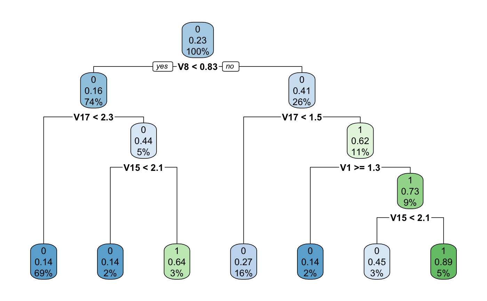
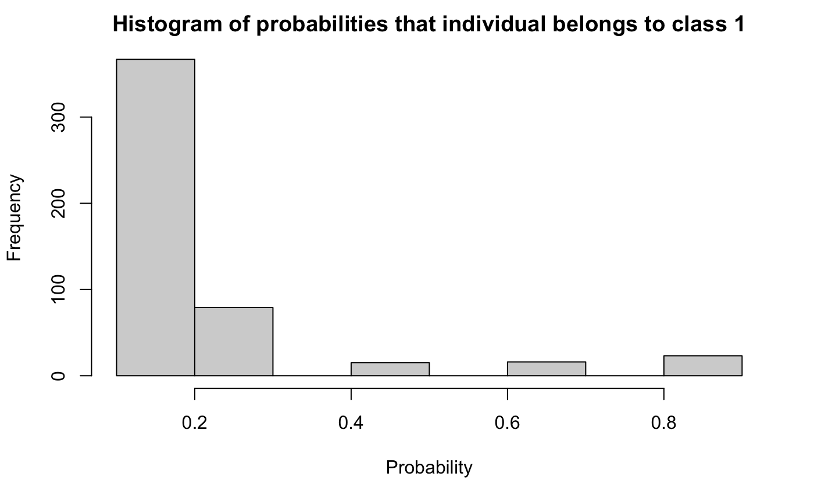
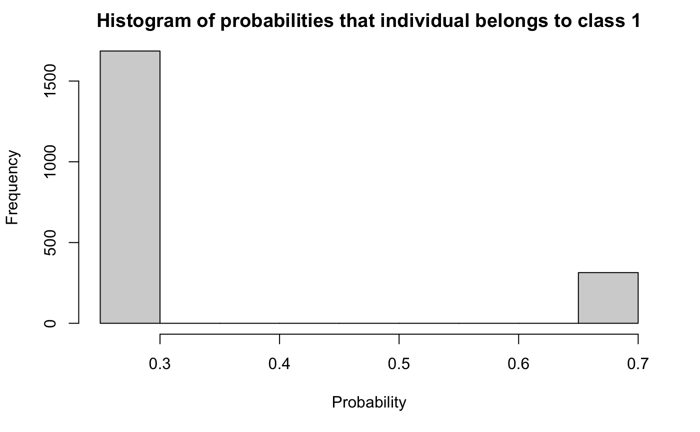
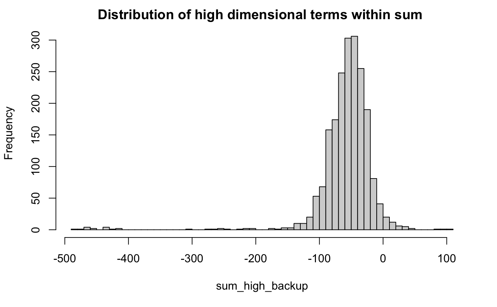
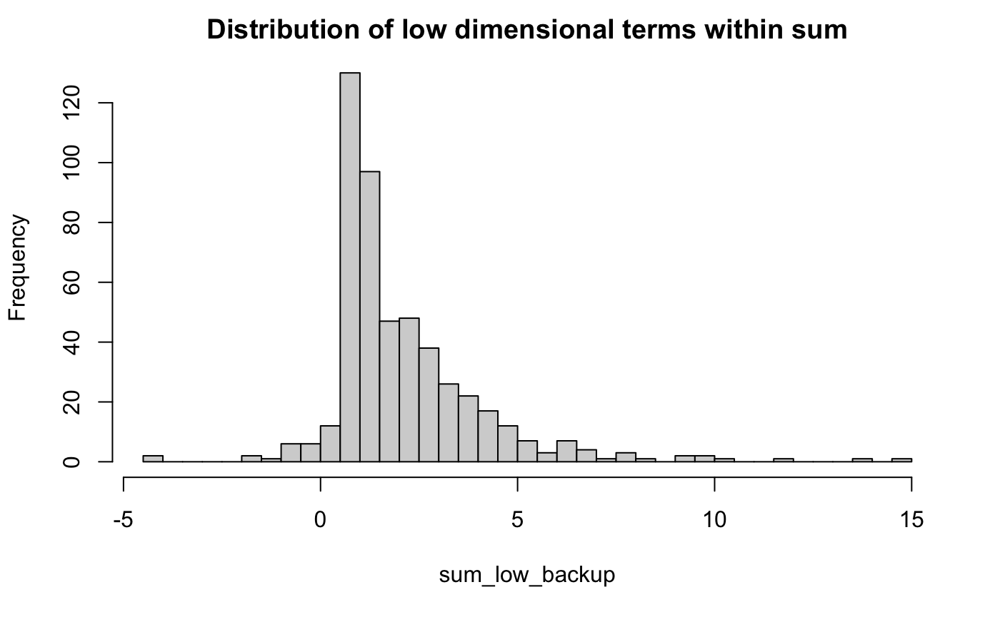

```{r setup, include=FALSE}
knitr::opts_chunk$set(echo = TRUE)
if (!require("kableExtra")) install.packages("kableExtra")
```

# Introduction
This project aims to explore different algorithms for causal inference. Causal inference refers to the process of drawing a conclusion about a causal connection based on the conditions of the occurrence of an effect. The goal is to estimate the average treatment effect (ATE) in detail through implementation (using R), evaluation, and comparison. The algorithms include Inverse Propensity Weighting, Doubly Robust Estimation, and Regression Estimate. For the first two algorithms, we also had to compute propensity score using classification and regression trees (CART). To evaluate our algorithms, we were given two data sets (low-dimensional and high-dimensional) as well as correct ATE.

# Step 1: Computing Propensity Scores
We define propensity score as 

$$
e(x) = Pr(T=1|X=x)
$$
assuming that for all x

$$
0<e(x)<1
$$

### Classification and Regression Trees (CART)
In this project we will be using CART to estimate the propensity scores. In brief, CART is a classification and regression algorithm, which specify a ‘tree’ of cut points that minimize some measures of diversity in the final nodes once the the tree is complete. CART provides a probability of class membership, which we will use as our propensity score.

For CART method, we first split the space into two regions, and model the response by the mean of Y in each region. We choose the variable and split-point to achieve the best fit. Then one or both of these regions are split into two more regions, and this process is continued, until some stopping rule is applied. The corresponding regression model predicts Y with a constant $c_m$ in region $R_m$, that is,

$$
\hat{f}(x) = \sum^M_{m=1}c_mI\{x \in R_m\}
$$

where M is the total number of regions.

###  Computing Propensity Scores
To compute propensity scores, we used CART. We built two separate fine-tuned models for high-dimensional and low-dimensional data, respectively. Each model returns a set of probabilities that a given data point belongs to class 1.

To evaluate the performance of propensity scores we made sure that all the values lie between 0 and 1 (exclusively) and that they are not close to 1 or 0. According to "Evaluating Online Ad Campaigns in a Pipeline: Causal Models At Scale", propensity scores close to 1 "arise if X nearly separates the controls and exposed. In that case, estimation by any method may be unwise because too few controls resemble the exposed"[10].

{width=60%}

{width=60%}

{width=60%}

{width=60%}


\newpage
# Step 2: Algorithms

## Inverse Propensity Weighting (IPW)
Inverse propensity score weighting provides a way to account for many confounders simultaneously, thereby strengthening causal inference of the effects of predictors on outcomes. Given that the average over the random sample underestimates the mean in the target population, we can use IPW to remove the selection bias. This approach was first introduced by Horvitz and Thompson in 1952 and has been further studied in recent KDD
papers.

To estimate the ATE, using IPW we first need to compute weights for each individual i. Each weight is the inverse of the estimated propensity score $\hat{e_i}$. 

$$
w_i = \frac{T_i}{\hat{e_i}} + \frac{1-T_i}{1-\hat{e_i}}
$$

If individual i belongs to class 1 then $w_i = \frac{1}{\hat{e_i}} + \frac{1-1}{1-\hat{e_i}} = \frac{1}{\hat{e_i}}$. On the contrary if  the individual i belongs to class 0 then $w_i = \frac{0}{\hat{e_i}} + \frac{1-0}{1-\hat{e_i}} = \frac{1}{1-\hat{e_i}}$.

We then use computed weights to estimate the ATE:

$$
\hat{\Delta}_{IPW} = \frac{1}{N}(\sum_{i \in treated}w_iY_i -\sum_{i \in controlled} w_iY_i)
$$

Source: https://static.googleusercontent.com/media/research.google.com/en//pubs/archive/36552.pdf

## Doubly Robust Estimation
Doubly robust model uses estimated propensity scores $\hat{e_i}$ for reweighting observations to eliminate confounding and selection bias in observational settings. It has the following formula for computing the ATE: 

$$
\hat{\Delta}_{DR} = \frac{1}{N}\sum^N_{i=1}\frac{T_iY_i - (T_i - \hat{e_i})\hat{m_1}(X_i)}{\hat{e_i}} - \frac{1}{N}\sum^N_{i=1}\frac{(1 - T_i)Y_i + (T_i - \hat{e_i})\hat{m_0}(X_i)}{1 - \hat{e_i}}
$$

where $\hat{m_t}(X)$ is a consistentt estimate for $E(Y|T=t, X)$ and is obtained by regressing the observed response $Y$ on $X$ in group t (where $t = 0, 1$). It is "doubly robust" in a way that it requires only one model to be consistent - either propensity score model or the regression model. Computation of both models makes the Doubly Robust Estimator less efficient however, it produces the smallest asymptotic variance. 

## Regression Estimate
Regression Estimate is a simple regression algorithm that doesn’t make use of the propensity score. The model makes predictions for the control and treatment groups, and calculates the ATE using these predictions. The formula is below: 

$$
\hat{\Delta}_{reg} = \frac{1}{N}\sum^N_{i=1}(\hat{m_1}X_i - \hat{m_0}X_i)
$$

The regression estimate was computed by first deriving consistent estimators for $E(Y|T =1, X)$ and $E(Y|T =1, X)$, respectively. These estimators were derived by computing two regression estimates on Y (corresponding to the subsets of the data where $T = 1$ and $T = 0$) using all the features as predictors. Then, using a simple for loop, we could easily compute the regression estimate for the dataset by looking at the linear model predictions on each row of data (observation). We took the difference of the predictions for the treated and untreated estimators and then summed all the differences, then divided by N (the number of observations) to get our average treatment effect. The approach was identical for both low-dimensional and high dimensional data. The expression for the time complexity was determined by that of linear regression, since this part of the algorithm dominated the rest.

{width=60%}

{width=60%}

\newpage
# Step 3: Define Evaluation Metrcis
Our group decided to use the following procedures and measures to evaluate algorithms: Complexity, Running time, and Performance. First, every algorithm should be evaluated based on complexity. The more complex algorithm is, the more computational power it requires. In other words, we wanted to see how run time depends on the size of the input. We then realized that all of our algorithms require a linear time in the number of inputs. The next metric to use was to see the relative running time of these algorithms. So we ran all the algorithms on a single machine to compute the actual running time. Finally, the most important metric for these algorithms is performance:
$$performance = (true\_ate - est\_ate)^2$$

Since we were given the true ATE that we can compare our results to, we decided that such a regression metric is the best one. Unlike MAE, it penalizes bigger mistakes. 

\newpage
# Step 4: Side-by-side Comparison of Algorithms 

## Low Dimensional Data
```{r echo=FALSE}

true_ate_ld = c(2.0901, 2.0901, 2.0901)
computed_ate_ld = c(6.620976, 2.175476, 2.125138)
performance_ld = (computed_ate_ld - true_ate_ld)^2

comparison_table_ld <- data.frame(
   "Algorithm" = c(
     "Inverse Propensity Weighting",
     "Doubly Robust Estimation",
     "Regression Estimate"),
   "Complexity" = c("O(N)", "O(N)", "O(N)"),
   "True_ATE" = true_ate_ld,
   "Computed_ATE" = computed_ate_ld,
   "Run_Time" = c("0.68s", "0.05s", "0.02s"),
   "Performance" = performance_ld
)

comparison_table_ld %>%
  kbl() %>%
  kable_styling(latex_options = "hold_position")
```

## High Dimensional Data
```{r echo=FALSE}
true_ate = c(-54.8558, -54.8558, -54.8558)
computed_ate = c(-60.09444, -57.47854, -57.426587)
performance = (computed_ate - true_ate)^2
   
comparison_table_hd <- data.frame(
   "Algorithm" = c(
     "Inverse Propensity Weighting",
     "Doubly Robust Estimation",
     "Regression Estimate"),
   "Complexity" = c("O(N)", "O(N)", "O(N)"),
   "True_ATE" = true_ate,
   "Computed_ATE" = computed_ate,
   "Run_Time" = c("1.93s", "0.47s", "0.28s"),
   "Performance" = performance
)

comparison_table_hd %>%
  kbl() %>%
  kable_styling(latex_options = "hold_position")
```

# Step 5: Analysis and Conclusion
To summarize our findings, we found that the Inverse Propensity Score performs the worst among the given three algorithms for both data sets. The reason lies in choosing the Classification and Regression Trees as a propensity score function. CART is very unstable because training a tree with a slightly different sub-sample causes the tree's structure to change drastically. Though we tried to avoid overfitting, it is hard to do so without using Random Forest or Bagging techniques.

The next algorithm, Doubly Robust Estimation, is our second-best result. It combines the result from Linear Regression Estimation and propensity scores to estimate the causal effect. This method reduces the likelihood of our estimate being biased since only one model needs to correctly specify the outcome to obtain an unbiased estimator. However, this model comes with its downsides - it is less efficient and more complex because it technically combines these two models.

And finally, our best algorithm is a Regression Estimate. Not only does it performs the best in term of the estimation, but it is also the simplest and the fastest model of all three. Also, an interesting observation is that the Regression Estimation algorithm performs slightly better than Doubly Robust Estimation. The reason probably lies in CART being very unstable. It introduces unnecessary bias to our model.

\newpage
# Appendix
## Propensity Score Function
```{r echo=TRUE}
# Source: https://uc-r.github.io/regression_trees
if (!require("rpart")) install.packages("rpart")

propensity_score_ld <- function(data) {
  # remove Y from the data set
  data_clean <- subset(data, select = -Y)
  
  # Train test split
  set.seed(123)
  data_split <- initial_split(data_clean, prop = .7)
  train <- training(data_split)
  test  <- testing(data_split)
  
  # build a model
  optimal_tree <- rpart(
    formula = A ~ .,
    data    = train,
    method  = "class",
    control = list(minsplit = 20, maxdepth = 15, cp = 0.0126)
  )
  
  # predictions
  pred <- predict(optimal_tree, newdata = data_clean)
  return(pred[, 2])
}

propensity_score_hd <- function(data) {
  # remove Y column
  data_clean <- subset(data, select = -Y)
  
  # Train test split
  set.seed(123)
  data_split <- initial_split(data_clean, prop = .7)
  train <- training(data_split)
  test  <- testing(data_split)
  
  # build a model
  optimal_tree <- rpart(
    formula = A ~ .,
    data    = train,
    method  = "class",
    control = list(minsplit = 11, maxdepth = 20, cp = 0.0126)
  )
  
  # predictions
  pred <- predict(optimal_tree, newdata = data_clean)
  return(pred[, 2])
}
```

\newpage
## Inverse Propensity Algorithm

```{r}
if(!require(rpart)) install.packages('rpart')
if(!require(rsample)) install.packages('rsample')
```

```{r}
#load low dimension data and high dimension data
data_ld <- read.csv(file = "../data/lowDim_dataset.csv")
data_hd <- read.csv(file = "../data/highDim_dataset.csv")
```

```{r}
source("../lib/propensity_score.R")
```

### ATE of lower dimension data using inverse propensity weighting

```{r}
#Set the starting time and calculate the propensity score of each observation 
#in low dimension data
start_time_ld <- Sys.time()
ps_ld <- propensity_score_ld(data_ld)

#Calculate the inverse propensity weight
ipw_ld <- rep(NA,nrow(data_ld))
for (i in 1:nrow(data_ld)){
#If the ith observation is in treated group, use 1/propensity score to 
#calculate the inverse propensity weight
  if (data_ld$A[i] == 1){
  ipw_ld[i] <- 1/ps_ld[i]
  }
#If the ith observation is in the controlled group, use 1/(1-propensity score) 
#to calculate the inverse propensity score
  else{
  ipw_ld[i] <- 1/(1-ps_ld[i])
  }
}

#Split low dimension data into treated group and control group, then calculate
#the ATE using inverse propensity score
treated_ld <- which(data_ld$A == 1)
controlled_ld <- which(data_ld$A == 0)

time.ate.ld<- system.time(
#Calculate the sum of production of Y value and inverse propensity weight of 
#each observation in the treated group and controlled group separately. 
#Subtract the sum of controlled group from the sum of treated group. 
#Then dividing this value by the total amount of observations in both group 
#will give us the ATE.
ATE_ipw_ld <- (sum(data_ld$Y[treated_ld] * ipw_ld[treated_ld]) - 
                  sum(data_ld$Y[controlled_ld] * ipw_ld[controlled_ld]))
                  /nrow(data_ld)
)
end_time_ld <- Sys.time()#Set ending time
dif_time_ld <- end_time_ld - start_time_ld#Time cost for the entire calculation
dif_time_ld
cat("ATE of lower dimension data using inverse propensity weighting is",
    ATE_ipw_ld, 
    "\n")
```


### ATE of higher dimension data using inverse propensity weighting

```{r}
#Set the starting time and calculate the propensity score of each observation 
#in high dimension data
start_time_hd <- Sys.time()

#Calculate the propensity scores of high dimension data
ps_hd <- propensity_score_hd(data_hd)

#Calculate inverse propensity weight using the above propensity score
ipw_hd <- rep(NA,nrow(data_hd))
for (i in 1:nrow(data_hd)){
#If the ith observation is in treated group, use 1/propensity score to 
#calculate the inverse propensity weight
  if (data_hd$A[i] == 1){
  ipw_hd[i] <- 1/ps_hd[i]
  }
  else{
#If the ith observation is in the controlled group, use 1/(1-propensity score) 
#to calculate the inverse propensity score
  ipw_hd[i] <- 1/(1-ps_hd[i])
  }
}

#Split high dimension data into treated group and control group, then calculate 
#the ATE using inverse propensity score
treated_hd <- which(data_hd$A == 1)
controlled_hd <- which(data_hd$A == 0)

time.ate.hd<- system.time(
#Calculate the sum of production of Y value and inverse propensity weight of 
#each observation in the treated group and controlled group separately. 
#Subtract the sum of controlled group from the sum of treated group. 
#Then dividing this value by the total amount of observations in both group 
#will give us the ATE.
ATE_ipw_hd <- (sum(data_hd$Y[treated_hd] * ipw_hd[treated_hd]) - 
                  sum(data_hd$Y[controlled_hd] * ipw_hd[controlled_hd]))
               /nrow(data_hd)
)
#Set the ending time
end_time_hd <- Sys.time()
#Get the time for the entire calculation
dif_time_hd <- end_time_hd - start_time_hd
dif_time_hd

cat("ATE of higher dimension data using inverse propensity weighting is",
    ATE_ipw_hd,
    "\n")
```
\newpage
## Regression Estimate Algorithm
```{r echo=FALSE}
# Setup
library(dplyr)
library(dbplyr)
library(dbplot)
library(DBI)
```

```{r}
# load data
dfh = read.csv('../data/highDim_dataset.csv')
dfl = read.csv('../data/lowDim_dataset.csv')

dfh_treated = dfh[dfh$A == 1, ]
dfh_control = dfh[dfh$A == 0, ]
dfl_treated = dfl[dfl$A == 1, ]
dfl_control = dfl[dfl$A == 0, ]

# start the timer
start = Sys.time()

# build the linear model for high dimenssional data
mhat_highdim_1 = lm(Y~., data=dfh_treated)
mhat_highdim_0 = lm(Y~., data=dfh_control)

# number of inputs
N = nrow(dfh)

# make predictions
m1_high_backup <- predict(mhat_highdim_1, newdata = dfh[,-1])
m0_high_backup <- predict(mhat_highdim_0, newdata = dfh[,-1])

# compute ATE
sum_high_backup <- m1_high_backup - m0_high_backup
output_high <- sum(sum_high_backup)/N
sprintf("High dimensional estiamte of ATE: %f", output_high)

# print time
end = Sys.time()
print(as.numeric(end - start, units = "secs"))

# build the linear model for low dimenssional data
mhat_lowdim_1 = lm(Y~., data=dfl_treated)
mhat_lowdim_0 = lm(Y~., data=dfl_control)

# start timer for low dim data
start = Sys.time()

# number of inputs
N = nrow(dfl)

# make Predictions 
m1_low_backup <- predict(mhat_lowdim_1, newdata = dfl[,-1])
m0_low_backup <- predict(mhat_lowdim_0, newdata = dfl[,-1])

# compute ATE
sum_low_backup <- m1_low_backup - m0_low_backup
output_low <- sum(sum_low_backup)/N
sprintf("Low-dimensional estiamte of ATE: %f", output_low)

#print time for low dim
end = Sys.time()
print(as.numeric(end - start, units = "secs"))

# print histograms for the distribution of the predicted treatment effects
hist(sum_low_backup, 
     main ='Distribution of low dimensional terms within sum', 
     breaks=50)
hist(sum_high_backup, 
     main = 'Distribution of high dimensional terms within sum ', 
     breaks=50)
```

\newpage
## Doubly Robust Estimation Algorithm

Setup
```{r message = F, warning = F}
if (!require("glmnet")) {
  install.packages("glmnet")
  library(glmnet)
}
if (!require("rsample")) {
  install.packages("rsample")
  library(rsample)
}
```

### Loading data
```{r message = F, warning = F}
ldim <- read.csv("../data/lowDim_dataset.csv")
hdim <- read.csv("../data/highDim_dataset.csv")

# Low Dimension
lA <- ldim$A
lY <- ldim$Y
lData <- ldim[,-c(1,2)]

# High Dimension
hA <- hdim$A
hY <- hdim$Y
hData <- hdim[, -c(1,2)]
```

### Computing propensity scores
```{r message = F, warning = F}
if (!require("rpart")) install.packages("rpart")
source("../lib/propensity_score.R")
#Calculate the propensity score of each observation in low and high dim data
ps_low <- propensity_score_ld(ldim)
ps_high <- propensity_score_hd(hdim)
```

### Predictions for Low dimenssional data
```{r message = F, warning = F}
#Set the starting time
start <- Sys.time()

#build the model
lr_low1 <- glm(formula=Y~ .,data = ldim[which(ldim$A=='1'),])
lr_low0 <- glm(formula=Y~ .,data = ldim[which(ldim$A=='0'),])

#make predictions
lm1 <- predict(lr_low1,ldim[,-c(1)])
lm0 <- predict(lr_low0,ldim[,-c(1)])

#compute the ATE using the formula
ATE_low <- sum((lA*lY-(lA-ps_low)*lm1)/ps_low)/dim(ldim)[1] - 
   sum(((1-lA)*lY+(lA-ps_low)*lm0)/(1-ps_low))/dim(ldim)[1]
ATE_low

#stop the timer
end <- Sys.time()

#print the time
paste("Low Dim Running time :",difftime(end,start))
```

### Predictions for high dimenssional data
```{r message = F, warning = F}
#Set the starting time
start <- Sys.time()

#build the model
lr_high1 <- glm(formula=Y~ .,data = hdim[which(hdim$A=='1'),])
lr_high0 <- glm(formula=Y~ .,data = hdim[which(hdim$A=='0'),])

#make predictions
hm1 <- predict(lr_high1,hdim[,-c(1)])
hm0 <- predict(lr_high0,hdim[,-c(1)])

#compute the ATE using the formula
ATE_high <- sum((hA*hY-(hA-ps_high)*hm1)/ps_high)/dim(hdim)[1] -
   sum(((1-hA)*hY+(hA-ps_high)*hm0)/(1-ps_high))/dim(hdim)[1]
ATE_high

#print the time
paste("High Dim Running time :",difftime(Sys.time(),start))
```

