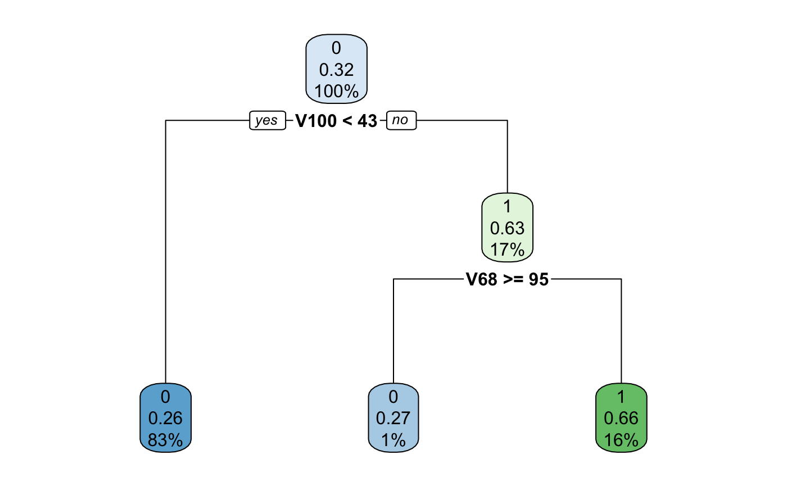

```{r setup, include=FALSE}
knitr::opts_chunk$set(echo = TRUE)
if (!require("kableExtra")) install.packages("kableExtra")
library(kableExtra)
```

# Introduction
This project aims to explore different algorithms for causal inference. Causal inference refers to the process of drawing a conclusion about a causal connection based on the conditions of the occurrence of an effect. The goal is to estimate the average treatment effect (ATE) in detail through implementation (using R), evaluation, and comparison. The algorithms include Inverse Propensity Weighting, Doubly Robust Estimation, and Regression Estimate. For the first two algorithms, we also had to compute propensity score using classification and regression trees (CART). To evaluate our algorithms, we were given two data sets (low-dimensional and high-dimensional) as well as correct ATE.

# Step 1: Computing Propensity Scores
We define propensity score as 

$$
e(x) = Pr(T=1|X=x)
$$
assuming that for all x

$$
0<e(x)<1
$$
### Classification and Regression Trees (CART)
In this project we will be using CART to estimate the propensity scores. In brief, CART is a classification and regression algorithm, which specify a ‘tree’ of cut points that minimize some measures of diversity in the final nodes once the the tree is complete. CART provides a probability of class membership, which we will use as our propensity score.

For CART method, we first split the space into two regions, and model the response by the mean of Y in each region. We choose the variable and split-point to achieve the best fit. Then one or both of these regions are split into two more regions, and this process is continued, until some stopping rule is applied. The corresponding regression model predicts Y with a constant $c_m$ in region $R_m$, that is,

$$
\hat{f}(x) = \sum^M_{m=1}c_mI\{x \in R_m\}
$$

where M is the total number of regions.


###  Computing Propensity Scores
To compute propensity scores, we used CART. We built two separate fine-tuned models for high-dimensional and low-dimensional data, respectively. Each model returns a set of probabilities that a given data point belongs to class 1.

{width=60%}

{width=60%}

{width=60%}

{width=60%}

# Step 2: Algorithms

## Inverse Propensity Weighting (IPW)
Inverse propensity score weighting provides a way to account for many confounders simultaneously, thereby strengthening causal inference of the effects of predictors on outcomes. Given that the average over the random sample underestimates the mean in the target population, we can use IPW to remove the selection bias. This approach was first introduced by Horvitz and Thompson in 1952 and has been further studied in recent KDD
papers.

To estimate the ATE, using IPW we first need to compute weights for each individual i. Each weight is the inverse of the estimated propensity score $\hat{e_i}$. 

$$
w_i = \frac{T_i}{\hat{e_i}} + \frac{1-T_i}{1-\hat{e_i}}
$$

If individual i belongs to class 1 then $w_i = \frac{1}{\hat{e_i}} + \frac{1-1}{1-\hat{e_i}} = \frac{1}{\hat{e_i}}$. On the contrary if  the individual i belongs to class 0 then $w_i = \frac{0}{\hat{e_i}} + \frac{1-0}{1-\hat{e_i}} = \frac{1}{1-\hat{e_i}}$.

We then use computed weights to estimate the ATE:

$$
\hat{\Delta}_{IPW} = \frac{1}{N}(\sum_{i \in treated}w_iY_i -\sum_{i \in controlled} w_iY_i)
$$

[TODO: Add implementation details]

Source: https://static.googleusercontent.com/media/research.google.com/en//pubs/archive/36552.pdf

## Doubly Robust Estimation
Doubly robust model uses estimated propensity scores $\hat{e_i}$ for reweighting observations to eliminate confounding and selection bias in observational settings. It has the following formula for computing the ATE: 

$$
\hat{\Delta}_{DR} = \frac{1}{N}\sum^N_{i=1}\frac{T_iY_i - (T_i - \hat{e_i})\hat{m_1}(X_i)}{\hat{e_i}} - \frac{1}{N}\sum^N_{i=1}\frac{(1 - T_i)Y_i + (T_i - \hat{e_i})\hat{m_0}(X_i)}{1 - \hat{e_i}}
$$

where $\hat{m_t}(X)$ is a consistentt estimate for $E(Y|T=t, X)$ and is obtained by regressing the observed response $Y$ on $X$ in group t (where $t = 0, 1$). It is "doubly robust" in a way that it requires only one model to be consistent - either propensity score model or the regression model. Computation of both models makes the Doubly Robust Estimator less efficient however, it produces the smallest asymptotic variance. 

[TODO: Add implementation details]

## Regression Estimate
Regression Estimate is a simple regression algorithm that doesn’t make use of the propensity score. The model makes predictions for the control and treatment groups, and calculates the ATE using these predictions. The formula is below: 

$$
\hat{\Delta}_{reg} = \frac{1}{N}\sum^N_{i=1}(\hat{m_1}X_i - \hat{m_0}X_i)
$$

The regression estimate was computed by first deriving consistent estimators for $E(Y|T =1, X)$ and $E(Y|T =1, X)$, respectively. These estimators were derived by computing two regression estimates on Y (corresponding to the subsets of the data where $T = 1$ and $T = 0$) using all the features as predictors. Then, using a simple for loop, we could easily compute the regression estimate for the dataset by looking at the linear model predictions on each row of data (observation). We took the difference of the predictions for the treated and untreated estimators and then summed all the differences, then divided by N (the number of observations) to get our average treatment effect. The approach was identical for both low-dimensional and high dimensional data. The expression for the time complexity was determined by that of linear regression, since this part of the algorithm dominated the rest.

# Step 3: Comparison of Algorithms for High Dimensional Data
Note: $performance = (true\_ate - est\_ate)^2$
```{r echo=FALSE}
true_ate = c(-54.8558, -54.8558, -54.8558)
computed_ate = c(-60.09444, -57.47854, -57.426587)
performance = (computed_ate - true_ate)^2
   
comparison_table_hd <- data.frame(
   "Algorithm" = c(
     "Inverse Propensity Weighting",
     "Doubly Robust Estimation",
     "Regression Estimate"),
   "Complexity" = c("O(N)", "O(N)", "O(N*P^2 + P^3)"),
   "True_ATE" = true_ate,
   "Computed_ATE" = computed_ate,
   "Run_Time" = c("1.1253 sec", "sec", "0.313 sec"),
   "Performance" = performance
)

comparison_table_hd %>%
  kbl() %>%
  kable_styling(latex_options = "hold_position")
```
# Step 4: Comparison of Algorithms for Low Dimensional Data
Note: $performance = (true\_ate - est\_ate)^2$
```{r echo=FALSE}

true_ate_ld = c(2.0901, 2.0901, 2.0901)
computed_ate_ld = c(6.620976, 2.175476, 2.125138)
performance_ld = (computed_ate_ld - true_ate_ld)^2

comparison_table_ld <- data.frame(
   "Algorithm" = c(
     "Inverse Propensity Weighting",
     "Doubly Robust Estimation",
     "Regression Estimate"),
   "Complexity" = c("O(N)", "O(N)", "O()"),
   "True_ATE" = true_ate_ld,
   "Computed_ATE" = computed_ate_ld,
   "Run_Time" = c("0.7064 sec", "sec", ".088 sec"),
   "Performance" = performance_ld
)

comparison_table_ld %>%
  kbl() %>%
  kable_styling(latex_options = "hold_position")
```
 
# Step 5: Analysis and Conclusion
As we can see from the table above ... 
